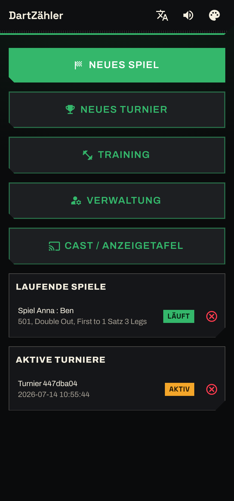
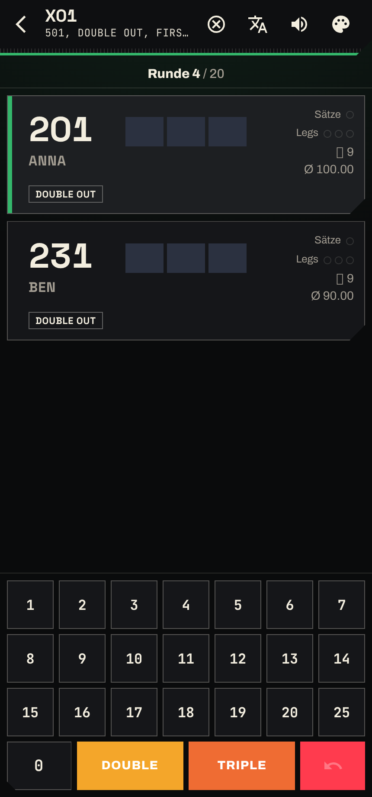
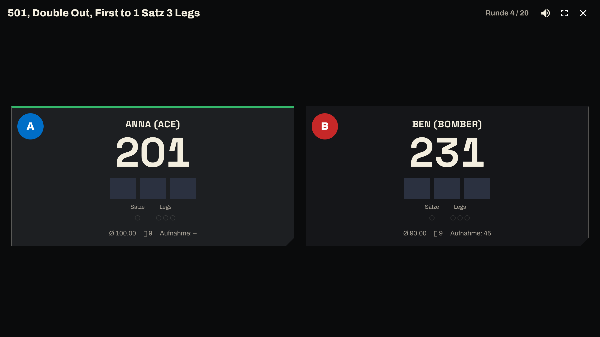
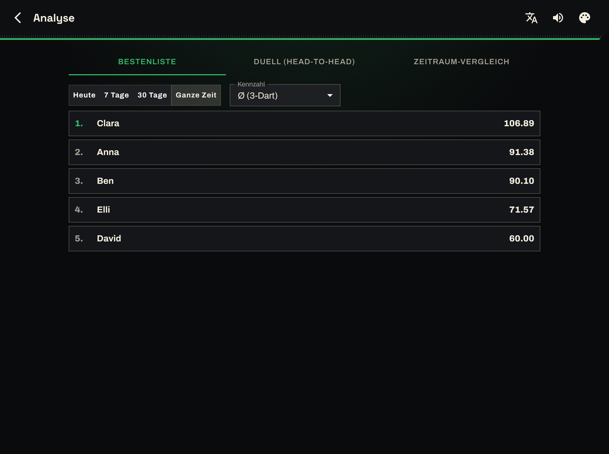
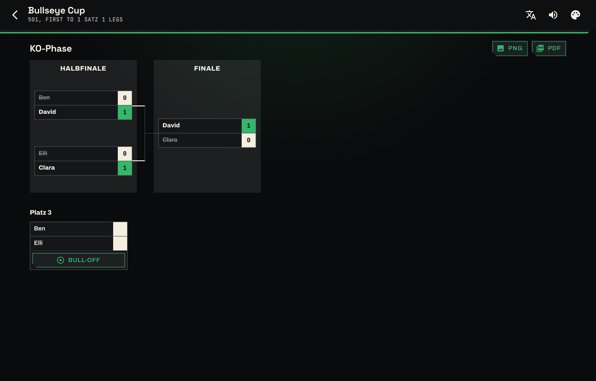

# 🎯 DartZähler

**[🇩🇪 Deutsch](README.md) | 🇬🇧 English**


A modern, responsive darts scorer for your local network – hosted on a Raspberry Pi. Phones act as input devices (numpad), laptops/monitors as the scoreboard. Supports singles and doubles/team games (501/301/101), bots (Easy/Medium/Hard), a tournament mode, live sync across multiple devices, a stats & analysis section, achievements and three themes. Fully bilingual (German/English) and offline-capable.

> A personal hobby project – not affiliated with any employer.

## Screenshots

<!-- Put screenshots under docs/screenshots/ (see docs/screenshots/README.md). -->

| Home | Game view | Scoreboard (Cast) |
| --- | --- | --- |
|  |  |  |

| Stats & analysis | Tournament bracket |
| --- | --- |
|  |  |

## Features

- **Game modes:** 501 / 301 / 101, check-in (straight/double in), checkout double/single/master – configurable per player.
- **Singles, doubles & teams:** variable team sizes, per-player and per-team checkout modes, saved fixed doubles.
- **Bots:** three difficulty levels (Easy/Medium/Hard) with a rule-based, adaptive AI.
- **Tournaments:** single-elimination brackets, PNG/PDF export.
- **Live sync:** multiple devices via Server-Sent Events; phone as numpad, monitor as cast scoreboard.
- **Stats & analysis:** averages, first-9, checkout %, 180s, leaderboards, head-to-head, period comparison, dependency-free client-side PDF report.
- **Achievements**, three themes, wake-lock in cast mode, match sounds.
- **Offline-first:** runs entirely on the Pi over HTTP in your LAN – no cloud required.

## Quick start

```bash
git clone https://github.com/Affensteve/dartzaehler.git
cd dartzaehler
npm run setup      # installs backend + frontend and builds the frontend
npm start          # starts the server (default: port 3000)
```

Then open `http://<host>:3000` in a browser. For Raspberry Pi deployment, updates and maintenance see the German [README.md](README.md) and [docs/SETUP.md](docs/SETUP.md).

## Architecture

- **Backend:** Express + better-sqlite3 (WAL), Server-Sent Events for live sync.
- **Frontend:** React 18 + MUI 5 + Vite 5, route-level code-splitting, custom DE/EN i18n.

## Documentation

- [docs/SETUP.md](docs/SETUP.md) – deployment details & troubleshooting
- [docs/API.md](docs/API.md) – REST API reference
- [docs/DESIGN.md](docs/DESIGN.md) – design system

## License

Released under the [MIT License](LICENSE). Use, modify and share freely – a star ⭐ is always appreciated.

## Support ☕

DartZähler is a personal open-source project. If you enjoy it and want to support further development, you can buy the developer a coffee:

[](https://paypal.me/SKunz1)

No obligation at all – feedback and pull requests are just as welcome.
